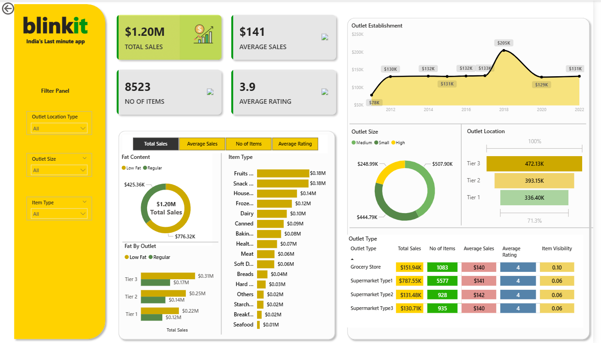

# Blinkit Sales Analysis (Power BI)

## 📌 Project Overview
This project provides a comprehensive analysis of Blinkit's sales data using Power BI. The goal is to uncover business insights such as top-selling categories, revenue trends, city-level performance, and customer purchasing behavior.

## 📊 Tools Used
- **Power BI** for data visualization and dashboard creation  
- **Microsoft Excel / CSV** for raw data handling

## 🔍 Key Features
- Monthly and yearly revenue analysis  
- Category-wise sales breakdown  
- City-wise performance visualization  
- Top-selling products and trends  
- Interactive filters for dynamic exploration

## 📁 Project Structure
Blinkit-Sales-Analysis/
├── data/ # Sales data in CSV format
├── images/ # Screenshots of dashboards
├── Blinkit_Sales.pbix # Power BI file
└── README.md # Project documentation

## 🖼️ Dashboard Preview
Include screenshots of the Power BI dashboard in the `images/` folder and link here like:

## 🚀 Getting Started
1. Clone or download the repository  
2. Open the `Blinkit_Sales.pbix` file in Power BI  
3. Refresh the dataset if needed  
4. Explore interactive visuals

## 🧠 Insights
- Major sales come from **City A and City B**  
- **Snacks** and **Beverages** are the top-performing categories  
- Highest sales observed in **Q4**

## 📌 Author
**Goutham Baggu**  
Data Analyst Intern  
[LinkedIn](https://www.linkedin.com/in/goutham-baggu-a0202728b/)
